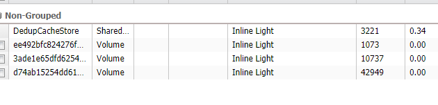
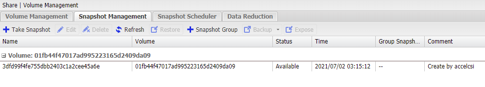

# 如何在kubernetes安裝accelcsi

## Setup

### Step 1

先clone [external-snapshotter](https://github.com/kubernetes-csi/external-snapshotter.git)後，執行安裝，請注意，本命令每個cluster只需一次

``` shell
    git clone https://github.com/kubernetes-csi/external-snapshotter.git
    kubectl create -f external-snapshotter/client/config/crd
    kubectl create -f external-snapshotter/deploy/kubernetes/snapshot-controller
```

### Step 2

安裝我們的[csi](https://github.com/accelstor/kubernetes-afa-plugin)

``` shell
    kubectl apply -f https://raw.githubusercontent.com/accelstor/kubernetes-afa-plugin/main/rbac-external-provisioner.yaml
    kubectl apply -f https://raw.githubusercontent.com/accelstor/kubernetes-afa-plugin/main/rbac-csi-snapshotter.yaml
    kubectl apply -f https://raw.githubusercontent.com/kubernetes-csi/external-attacher/master/deploy/kubernetes/rbac.yaml
    kubectl apply -f https://raw.githubusercontent.com/accelstor/kubernetes-afa-plugin/main/serviceaccount.yaml
```

下載並指向AFA正確IP，填入正確AFATOKEN

``` shell
    curl https://raw.githubusercontent.com/accelstor/kubernetes-afa-plugin/main/accelcsi.yaml
    vim accelcsi.yaml
```

從[env](https://github.com/accelstor/kubernetes-afa-plugin/blob/main/accelcsi.yaml#L117)位置處開始編輯

``` yaml
          env:
            - name: AFA_IP
              value: "10.146.6.205"
            - name: AFA_KEY
              value: "fa3fed9fceda15dd7960c3431c406f58848fd22f"
            - name: AFA_HTTPS
              value: "false"
```

apply剛剛編輯好的檔案，csi plugin就會正確地把volume掛載

``` shell
kubectl apply -f accelcsi.yaml
```

這樣csi就算安裝完成了

## Usage

在實際將volume分配給pod前，我們須先使用csi plugin來create pvc，以下範例分別分配出1G、10G、40G大小的空間

``` yaml
apiVersion: storage.k8s.io/v1
kind: StorageClass
metadata:
  name: sc.csi.accelstor.com
provisioner: csi.accelstor.com
reclaimPolicy: Delete
volumeBindingMode: Immediate

---

apiVersion: v1
kind: PersistentVolumeClaim
metadata:
  name: pvc1.csi.accelstor.com
spec:
  accessModes:
  - ReadWriteOnce
  resources:
    requests:
      storage: 1Gi
  storageClassName: sc.csi.accelstor.com # defined in csi-setup.yaml
---

apiVersion: v1
kind: PersistentVolumeClaim
metadata:
  name: pvc2.csi.accelstor.com
spec:
  accessModes:
  - ReadWriteOnce
  resources:
    requests:
      storage: 10Gi
  storageClassName: sc.csi.accelstor.com # defined in csi-setup.yaml

---

apiVersion: v1
kind: PersistentVolumeClaim
metadata:
  name: pvc3.csi.accelstor.com
spec:
  accessModes:
  - ReadWriteOnce
  resources:
    requests:
      storage: 40Gi
  storageClassName: sc.csi.accelstor.com # defined in csi-setup.yaml
```

create一個pod，並把pvc配置給該pod

``` yaml
apiVersion: v1
kind: Pod
metadata:
  name: shell-demo
spec:
  containers:
  - name: nginx
    image: nginx
    volumeMounts:
    - name: shared-data
      mountPath: /usr/share/nginx/html
  volumes:
  - name: shared-data
    persistentVolumeClaim:
      claimName: pvc1.csi.accelstor.com # defined in csi-pvs.yaml
```

這樣pod就會自動將該volume配置給pod，以下是pod狀態

``` shell
Name:         shell-demo
Namespace:    default
Priority:     0
Node:         accelstor-hs-218/10.144.1.218
Start Time:   Tue, 12 Jan 2021 14:40:31 +0800
Labels:       <none>
Annotations:  <none>
Status:       Pending
IP:           
IPs:          <none>
Containers:
  nginx:
    Container ID:   
    Image:          nginx
    Image ID:       
    Port:           <none>
    Host Port:      <none>
    State:          Waiting
      Reason:       ContainerCreating
    Ready:          False
    Restart Count:  0
    Environment:    <none>
    Mounts:
      /usr/share/nginx/html from shared-data (rw)
      /var/run/secrets/kubernetes.io/serviceaccount from default-token-74smr (ro)
Conditions:
  Type              Status
  Initialized       True 
  Ready             False 
  ContainersReady   False 
  PodScheduled      True 
Volumes:
  shared-data:
    Type:       PersistentVolumeClaim (a reference to a PersistentVolumeClaim in the same namespace)
    ClaimName:  pvc1.csi.accelstor.com
    ReadOnly:   false
  default-token-74smr:
    Type:        Secret (a volume populated by a Secret)
    SecretName:  default-token-74smr
    Optional:    false
QoS Class:       BestEffort
Node-Selectors:  <none>
Tolerations:     node.kubernetes.io/not-ready:NoExecute op=Exists for 300s
                 node.kubernetes.io/unreachable:NoExecute op=Exists for 300s
```



## 備份與還原

現在您可以使用kubernetes來管理您的AFA snapshot，只需要簡單的yaml即可。

### 備份

延續上個範例，假設我們想對`pvc1.csi.accelstor.com`這個pvc做snapshot，首先，您必須先創建一個自定義的VolumeSnapshotClass

```
apiVersion: snapshot.storage.k8s.io/v1
kind: VolumeSnapshotClass
metadata:
  name: snapclass.csi.accelstor.com
driver: csi.accelstor.com
deletionPolicy: Delete
parameters:
```

使用該VolumeSnapshotClass來創建一個全新的snapshot。由於SnapshotClass內已指定driver為我們的csi，故創建的訊息會被傳遞至csi內並由csi創建。

```
apiVersion: snapshot.storage.k8s.io/v1beta1
kind: VolumeSnapshot
metadata:
  name: pvc1-snapshot
spec:
  volumeSnapshotClassName: snapclass.csi.accelstor.com
  source:
    persistentVolumeClaimName: pvc1.csi.accelstor.com
```

此時您應該可在snapshot頁面見到snapshot已被創建



### 還原

還原也相當簡單，您只要指定dataSource為剛剛您命名的`pvc1-snapshot`，這樣kubernetes自然知道從何處還原您的volume。

```
apiVersion: v1
kind: PersistentVolumeClaim
metadata:
  name: pvc1-restore
spec:
  storageClassName: sc.csi.accelstor.com
  dataSource:
    name: pvc1-snapshot
    kind: VolumeSnapshot
    apiGroup: snapshot.storage.k8s.io
  accessModes:
    - ReadWriteOnce
  resources:
    requests:
      storage: 1Gi
```

storage為必填項目，請勿任意調整以免造成未知錯誤。

## 親和性設定

當您使用本設定檔在多個node的環境中，replicas小於目標node數有可能導致生成的pod沒有在擁有csi功能的node上，此時你會希望設定親和性只讓特定pod生成在特定node內。

```
  affinity:
    podAffinity:
      requiredDuringSchedulingIgnoredDuringExecution:
      - labelSelector:
          matchExpressions:
          - key: app
            operator: In
            values:
            - csi-accelstor
        topologyKey: "kubernetes.io/hostname"
```

將該段落加入至pod內，pod就只會在擁有csi的node運行。

## 擴展設定

您可以將replicas拓展至任意數字n(n < node數)，或者改寫成daemonset，但使用複數擴展時，請確保使用本公司最新版本的AFA，它們具有API層面的lock可以避免意外發生。

## iscsi設定

範例`accelcsi.yaml`是使用內部iscsi，可能會與node本身的iscsi發生衝突，若您希望使用host的iscsid來進行管理，請參照`accelcsi-hostiscsi.yaml`，他會指引您使用node host的iscsi物件。

## 備註

- Fibre channel的機器目前不支援kubernetes的plugin支援
- 你可能需要修改accelcsi.yaml的機器位置和token以適應自己的機器

## rbac-csi-snapshotter.yaml
https://github.com/kubernetes-csi/external-snapshotter/blob/master/deploy/kubernetes/csi-snapshotter/rbac-csi-snapshotter.yaml

## rbac-external-provisioner.yaml
https://github.com/kubernetes-csi/external-provisioner/blob/master/deploy/kubernetes/rbac.yaml
