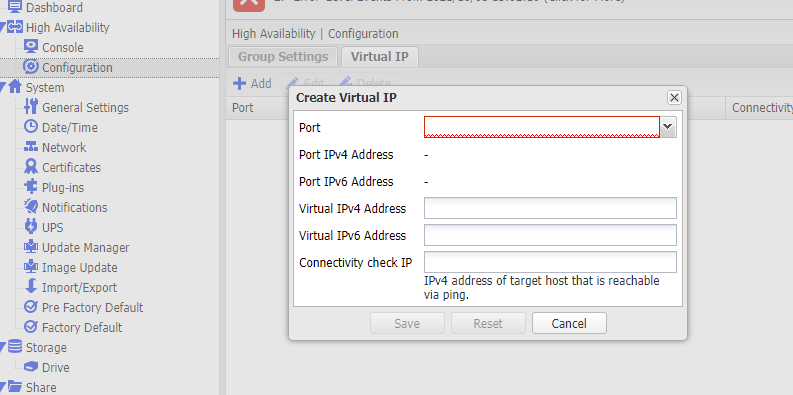

# 如何在kubernetes安裝accelcsi

## Outline

## 版本定義

Kubernetes 1.20+ 能獲得最好的CSI體驗

當您的版本介於1.17 - 1.20，請更換第一步驟的`external-snapshotter/client/config/crd`為`https://github.com/kubernetes-csi/external-snapshotter/tree/release-3.0/client/config/crd`

低於1.17的版本，請參考[feature-gate](https://kubernetes.io/docs/reference/command-line-tools-reference/feature-gates/)來開啟功能，但由於在1.17內csi諸多功能處於Beta或Alpha階段，我們並不能保證CSI的運行。關於任何1.17以下的錯誤或問題，本guide沒有辦法提供幫助。

低於1.12版本將無法使用csi

關於各csi功能最低需求版本如下：

Feature                                                                                       | Mini Support version | Compatible Version
----------------------------------------------------------------------------------------------|----------------------|-------------------
[CSI Snapshotter 4.0](https://github.com/kubernetes-csi/external-snapshotter)                 | 1.20                 | 1.20
[CSI Snapshotter 3.0](https://github.com/kubernetes-csi/external-snapshotter/tree/release-3.0)| 1.17                 | 1.17
[CSI Resizer](https://github.com/kubernetes-csi/external-resizer)                             | 1.16                 | 1.20
[CSI provisioner](https://github.com/kubernetes-csi/external-provisioner)                     | 1.17                 | 1.21
[Node Driver Registrar](https://github.com/kubernetes-csi/node-driver-registrar)              | 1.13                 | *

### 關於執行環境

centos7的作業系統請使用centos7的tag`quay.io/accelstor/accelcsi:centos7`

如果你的kubernetes是新舊混用，且因為歷史因素難以統一node環境，需為每個node設定tag並建立複數DaemonSet並設定nodeAffinity，以達到讓不同版本host自動對應版本csi

## Setup

### 環境設定

#### Multipath

設定所有node的multipath，請先在所有目標機器上安裝multipath，並設定本公司的iscsi disk為例外
不打算使用iscsi的使用者，或者並非HA系列的使用者可以跳過此步驟

``` bash
yum install device-mapper-multipath -y
/sbin/mpathconf --enable
```

編輯 /etc/multipath.conf

``` 
blacklist_exceptions {
        property "(SCSI_IDENT_|ID_WWN|ID_SERIAL)"
        device {
                vendor "AStor"
        }
}

blacklist {
        devnode "^sda$"
}

```

上面範例是將sda設定為黑名單(系統開機碟)並將AccelStor的硬碟設為例外，實際情況請依照當時機器設定為準

``` bash
systemctl start multipathd
systemctl enable multipathd
```

##### 已知問題

centos7.7以前的版本搭載multipath 0.4.9，會遇到[該bug](https://bugs.debian.org/cgi-bin/bugreport.cgi?bug=782488)，必須加入`ID_SERIAL`字段。其餘版本可放心使用`property "(SCSI_IDENT_|ID_WWN)"`

#### Iscsi

筆者建議使用內部的iscsi，所以請關閉iscsi服務，不打算使用iscsi的使用者可以跳過此步驟

``` bash
systemctl stop iscsid
systemctl stop iscsi
systemctl stop iscsid.socket
systemctl disable iscsid
systemctl disable iscsid.socket
systemctl disable iscsi
```

### NFS

HA系列請先設置virtual ip



必須設定ipv4 IP且確定kubernetes每一個node都能正確連上目的port。您可以使用其他工具如ping/curl/netcat來測試該virtual ip是否正確工作，如果沒有請檢查機器後方的網路孔是否與kubernetes叢集接到同一網路內。請注意每一個data port並不是互通的，倘若在data port 1上設置正確的virtual ip，卻將網路線插在port 2，那麼網路是不會通的。

確定virtual ip可以工作後，請修改accelcsi.yaml並將ip1替換成virtual ip，在本例中，不需要設定IP2。

```
          env:
            - name: AFA_IP
              value: "10.146.6.104"
```

### Step 1

**執行前請先注意版本**

先clone [external-snapshotter](https://github.com/kubernetes-csi/external-snapshotter.git)後，執行安裝，請注意，本命令每個cluster只需一次

``` shell
    git clone https://github.com/kubernetes-csi/external-snapshotter.git
    kubectl create -f external-snapshotter/client/config/crd
    kubectl create -f external-snapshotter/deploy/kubernetes/snapshot-controller
```

如果你低於1.20版本，那麼release-3.0很適合你。

``` shell
    git clone https://github.com/kubernetes-csi/external-snapshotter.git -b release-3.0
    kubectl create -f external-snapshotter/client/config/crd
    kubectl create -f external-snapshotter/deploy/kubernetes/snapshot-controller
```

### Step 2

安裝我們的[csi](https://github.com/accelstor/kubernetes-afa-plugin)

``` shell
    kubectl apply -f https://raw.githubusercontent.com/accelstor/kubernetes-afa-plugin/main/rbac-external-provisioner.yaml
    kubectl apply -f https://raw.githubusercontent.com/accelstor/kubernetes-afa-plugin/main/rbac-csi-snapshotter.yaml
    kubectl apply -f https://raw.githubusercontent.com/kubernetes-csi/external-attacher/master/deploy/kubernetes/rbac.yaml
    kubectl apply -f https://raw.githubusercontent.com/kubernetes-csi/external-resizer/master/deploy/kubernetes/rbac.yaml
    kubectl apply -f https://raw.githubusercontent.com/accelstor/kubernetes-afa-plugin/main/serviceaccount.yaml
```

下載並指向AFA正確IP，填入正確AFATOKEN

``` shell
    curl -LO https://raw.githubusercontent.com/accelstor/kubernetes-afa-plugin/main/accelcsi.yaml
    vim accelcsi.yaml
```

從[env](https://github.com/accelstor/kubernetes-afa-plugin/blob/main/accelcsi.yaml#L117)位置處開始編輯

``` yaml
          env:
            - name: AFA_IP
              value: "10.146.6.205"
            - name: AFA_KEY
              value: "fa3fed9fceda15dd7960c3431c406f58848fd22f"
            - name: AFA_HTTPS
              value: "false"
```

如果你低於1.20版本，不要忘記將snapshotter更換成3.0.3版本

``` patch
        - name: csi-snapshotter
-          image: quay.io/k8scsi/csi-snapshotter:v4.0.0
+          image: quay.io/k8scsi/csi-snapshotter:v3.0.3
```

如果你是centos7架設的kubernetes，別忘了修改容器版本

```patch
-          - image: quay.io/accelstor/accelcsi:v407
+          - image: quay.io/accelstor/accelcsi:centos7
```

apply剛剛編輯好的檔案，csi plugin就會正確地把volume掛載

``` shell
kubectl apply -f accelcsi.yaml
```

這樣csi就算安裝完成了

#### 機器是HA的狀況

當您的機器是H系列，請移除ip2前方的#符號，並填上正確的IP

```yaml
            - "-ip=$(AFA_IP)"
            #- "-ip2=$(AFA_IP2)" #Only set in H series
```

``` yaml
          env:
            - name: AFA_IP
              value: "10.146.6.205"
            - name: AFA_IP2
              value: "10.146.6.105" #Only set in H series
            - name: AFA_KEY
              value: "fa3fed9fceda15dd7960c3431c406f58848fd22f"
            - name: AFA_HTTPS
              value: "false"
```

其餘設定與P系列相同

## Usage

使用前必須先建立StorageClass，我們已經準備了一個範例，實際情況請依需求修改

```
kubectl apply -f storageclass.yaml
```

在實際將volume分配給pod前，我們須先使用csi plugin來create pvc，以下範例分別分配出1G、10G、40G大小的空間

``` yaml
apiVersion: v1
kind: PersistentVolumeClaim
metadata:
  name: pvc1.csi.accelstor.com
spec:
  accessModes:
  - ReadWriteOnce
  resources:
    requests:
      storage: 1Gi
  storageClassName: sc.csi.accelstor.com # defined in csi-setup.yaml
---

apiVersion: v1
kind: PersistentVolumeClaim
metadata:
  name: pvc2.csi.accelstor.com
spec:
  accessModes:
  - ReadWriteOnce
  resources:
    requests:
      storage: 10Gi
  storageClassName: sc.csi.accelstor.com # defined in csi-setup.yaml

---

apiVersion: v1
kind: PersistentVolumeClaim
metadata:
  name: pvc3.csi.accelstor.com
spec:
  accessModes:
  - ReadWriteOnce
  resources:
    requests:
      storage: 40Gi
  storageClassName: sc.csi.accelstor.com # defined in csi-setup.yaml
```

create一個pod，並把pvc配置給該pod

``` yaml
apiVersion: v1
kind: Pod
metadata:
  name: shell-demo
spec:
  containers:
  - name: nginx
    image: nginx
    volumeMounts:
    - name: shared-data
      mountPath: /usr/share/nginx/html
  volumes:
  - name: shared-data
    persistentVolumeClaim:
      claimName: pvc1.csi.accelstor.com # defined in csi-pvs.yaml
```

這樣pod就會自動將該volume配置給pod，以下是pod狀態

``` shell
Name:         shell-demo
Namespace:    default
Priority:     0
Node:         accelstor-hs-218/10.144.1.218
Start Time:   Tue, 12 Jan 2021 14:40:31 +0800
Labels:       <none>
Annotations:  <none>
Status:       Pending
IP:           
IPs:          <none>
Containers:
  nginx:
    Container ID:   
    Image:          nginx
    Image ID:       
    Port:           <none>
    Host Port:      <none>
    State:          Waiting
      Reason:       ContainerCreating
    Ready:          False
    Restart Count:  0
    Environment:    <none>
    Mounts:
      /usr/share/nginx/html from shared-data (rw)
      /var/run/secrets/kubernetes.io/serviceaccount from default-token-74smr (ro)
Conditions:
  Type              Status
  Initialized       True 
  Ready             False 
  ContainersReady   False 
  PodScheduled      True 
Volumes:
  shared-data:
    Type:       PersistentVolumeClaim (a reference to a PersistentVolumeClaim in the same namespace)
    ClaimName:  pvc1.csi.accelstor.com
    ReadOnly:   false
  default-token-74smr:
    Type:        Secret (a volume populated by a Secret)
    SecretName:  default-token-74smr
    Optional:    false
QoS Class:       BestEffort
Node-Selectors:  <none>
Tolerations:     node.kubernetes.io/not-ready:NoExecute op=Exists for 300s
                 node.kubernetes.io/unreachable:NoExecute op=Exists for 300s
```


### 使用NFS

NFS的volume不支援block mode，請勿在pod中使用block mode。

以下是nfs的簡短範例：

```
apiVersion: storage.k8s.io/v1
kind: StorageClass
metadata:
  name: nfs.csi.accelstor.com
provisioner: csi.accelstor.com
reclaimPolicy: Delete
volumeBindingMode: Immediate
allowVolumeExpansion: true
parameters:
  type: nfs
---
apiVersion: v1
kind: PersistentVolumeClaim
metadata:
  name: pvc1.csi.accelstor.com
spec:
  accessModes:
  - ReadWriteOnce
#  volumeMode: nfs
  resources:
    requests:
      storage: 1Gi
  storageClassName:  nfs.csi.accelstor.com # defined in csi-setup.yaml
```

### NFS的virtual ip

將本行的註解取消

```
            #- "-virtualip=$(AFA_VIRTUALIP)"  #Set if you wanna use NFS with dataport
```

然後對你要使用的dataport建立virtual ip

```
          env:
            - name: AFA_VIRTUALIP
              value: "10.146.6.104"
```

沒有vip功能的機台也可以直接填入data port，NFS會使用該port連線。HA版本也可以直接填入data port而不使用virtual ip，不過當服務機台進入R mode時會斷線。

## 備份與還原

現在您可以使用kubernetes來管理您的AFA snapshot，只需要簡單的yaml即可。

### 備份

延續上個範例，假設我們想對`pvc1.csi.accelstor.com`這個pvc做snapshot，首先，您必須先創建一個自定義的VolumeSnapshotClass

```
apiVersion: snapshot.storage.k8s.io/v1
kind: VolumeSnapshotClass
metadata:
  name: snapclass.csi.accelstor.com
driver: csi.accelstor.com
deletionPolicy: Delete
parameters:
```

使用該VolumeSnapshotClass來創建一個全新的snapshot。由於SnapshotClass內已指定driver為我們的csi，故創建的訊息會被傳遞至csi內並由csi創建。

```
apiVersion: snapshot.storage.k8s.io/v1beta1
kind: VolumeSnapshot
metadata:
  name: pvc1-snapshot
spec:
  volumeSnapshotClassName: snapclass.csi.accelstor.com
  source:
    persistentVolumeClaimName: pvc1.csi.accelstor.com
```

此時您應該可在snapshot頁面見到snapshot已被創建


### 還原

還原也相當簡單，您只要指定dataSource為剛剛您命名的`pvc1-snapshot`，這樣kubernetes自然知道從何處還原您的volume。

```
apiVersion: v1
kind: PersistentVolumeClaim
metadata:
  name: pvc1-restore
spec:
  storageClassName: sc.csi.accelstor.com
  dataSource:
    name: pvc1-snapshot
    kind: VolumeSnapshot
    apiGroup: snapshot.storage.k8s.io
  accessModes:
    - ReadWriteOnce
  resources:
    requests:
      storage: 1Gi
```

storage為必填項目，請勿任意調整以免造成未知錯誤。

## iscsi設定

範例`accelcsi.yaml`是使用內部iscsi，可能會與node本身的iscsi發生衝突，若您希望使用host的iscsid來進行管理，請參照`accelcsi-hostiscsi.yaml`，它會指引您使用node host的iscsi物件。

## 備註

- Fibre channel的機器目前不受kubernetes的plugin支援
- 你可能需要修改accelcsi.yaml的機器位置和token以適應自己的機器
- 某些linux發行版不會自動load iscsi_tcp，你必須在執行accelcsi前modprobe iscsi_tcp，或者將iscsi_tcp加入到modprobe.conf or /etc/modprobe.d
